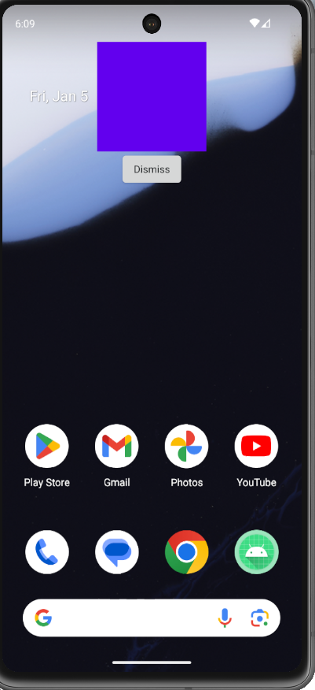

# Overlay Display App

## About the App

Overlay Display is an App with the purpose of showing an overlay view into the user's device screen through a timer once a day.

## Basic Instructions to Build
````
1. Clone the project and open it in your Android Studio
2. Synchonize dependencies and execute the App
````

## How the App works

To see the app working, you'll need to launch it to start the Alarm and then once it has passed 60 seconds, 
an example overlay will appear on screen just as in the example below:

